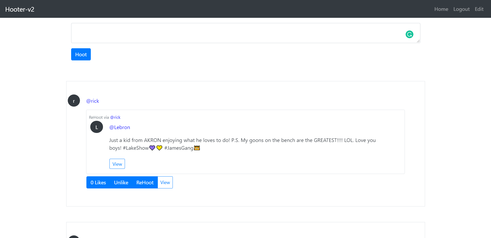

# Hooter-v2 - Twitter for Owls

A basic twitter clone made with the Django Rest Framework and React.js

## Features
Here are the following features:
* Hoots
  * Users can create Hoots
  * Like / Unlike Hoots
  * ReHoot
 
* Accounts
  * Register Accounts
  * Login / Logout
  * Edit Profile information  

* Follow
  * Users can Follow / Unfollow other users for their hoots to show up on their personal feed
  * View others users profile page to see all of their hoots
  
* Misc items related to Django
  * REST API
  * Unit Testing
  * Signals
  * Model Managers
  * User + Custom Auth
  * Custom Serialization
  * Pagination
